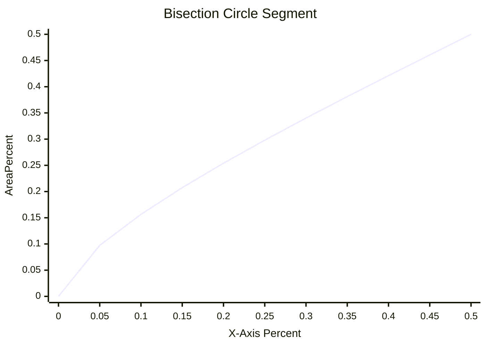
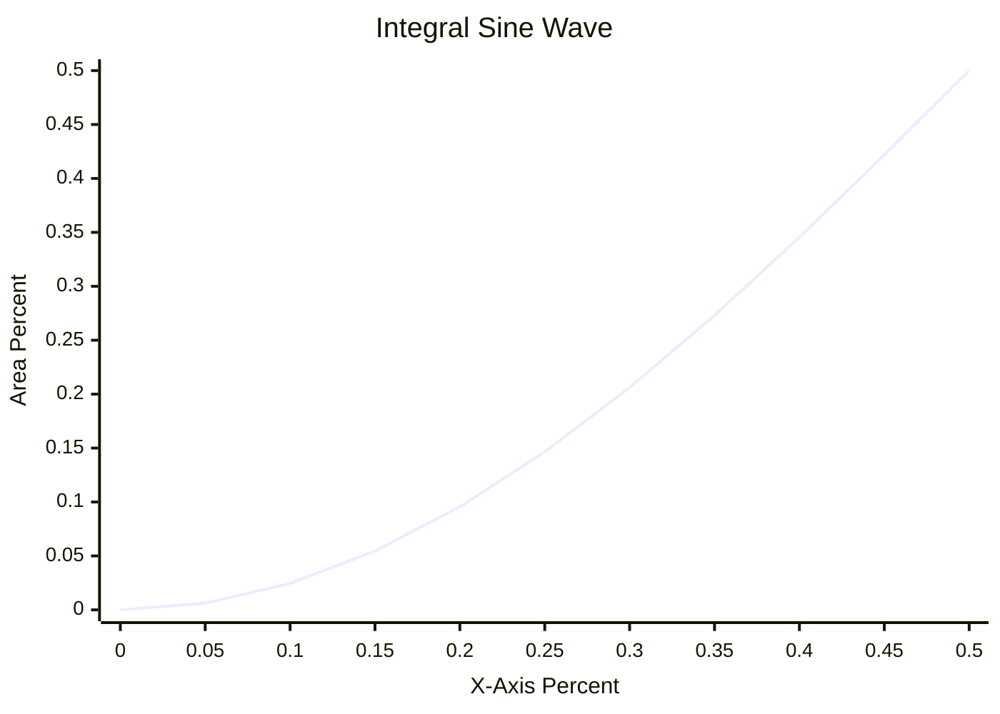

# DIY Heating Plate for Soldering

## What Can the Reader Expect?

I will delve deeply into programming and electrical engineering. Good knowledge of these topics is not necessary, as I will explain many parts, but a basic understanding helps. I will discuss the challenges I faced in completing my first complex electronics project.

## My Background

Over the past few years, I have dabbled in electronics and completed a few smaller projects, starting with testing circuits on a breadboard, initially with LEDs, later with transistors. I learned a lot through YouTube videos and trial and error. I then started learning [KiCad](https://www.kicad.org/) to digitally create circuits and eventually PCBs.

Since my youth, I have also been involved with 3D modeling software, initially 3Ds Max, later Blender. I have been programming since my youth and have been doing it professionally for over 10 years.

## Why a Heating Plate?

Another project of mine was to create an extension for FDM 3D printers that allows using two nozzles simultaneously, with the nozzles being independently raised and lowered to contact the object being printed. Currently, I use [Marlin](https://marlinfw.org/), but the hardware in my 3D printer is so weak that it can barely run the firmware, let alone an extension like this. I then looked online and came across [Klipper](https://www.klipper3d.org/), a firmware that connects the printer to a RaspberryPi and offloads most of the calculations to it. This means you don't need a powerful processor directly in the 3D printer. I am already using [OctoPi](https://octoprint.org/download/) to control my printer via a web interface and an additional touchscreen, making the switch to Klipper a logical step.

My PCB should have an [RP2040](https://www.raspberrypi.com/documentation/microcontrollers/rp2040.html) processor, like the one used in RaspberryPi Zero. It is a small, inexpensive (~1€), and powerful processor that would work for controlling the additional IOs provided by my PCB. Klipper also allows connecting multiple minicomputers with the Klipper firmware to work together. My PCB would then be a second minicomputer in the 3D printer.

I created the PCB with KiCad and had 5 of them produced in China by JLCPCB. I have a small soldering station with a soldering iron and a hot air gun. The RP2040 is a QFN (Quad Flat No-lead).


  
  


This means the contacts only exist under the chip, and each contact is only 0.2mm in size, making it extremely difficult to solder. It might not be impossible, and some manage to do it, but not me; I've tried... I had the most success with the hot air gun, but I had to heat the chip for a long time and at high temperatures, to the point where the labeling on the chip had vanished. Unfortunately, the chip did not boot, and I assume it was damaged in the process. These packages are actually intended for a different soldering process, one where the entire PCB is heated, and the solder under the chip becomes liquid.

A sensible person would have spent 100€ to get a soldering heating plate, but that person is not me. I wanted to make a heating plate myself, and it sounded like an interesting task, but of course, it was much more complicated than I had imagined.

## Rough Overview of the Steps

### Understanding the Requirement

I needed a heating plate that I could use for soldering. I found this [400W heating plate](https://www.amazon.de/gp/product/B08XB7MP9L/) that runs on mains voltage, which should be hot enough for soldering. The plate needs mains voltage, making it my first project involving that, which I had previously tried to avoid. There is a certain health risk if I make a major mistake.

I would like to be able to switch the heating plate on or off via a microcontroller. For safety, I would galvanically isolate the parts of the circuit that involve mains voltage from those that don't, meaning there is no direct electrical connection between them. This is important in case of a fault, incorrect connection, or overvoltage. There are a few ways to achieve this, with optocouplers being the classic choice for signals. You can think of an optocoupler as a small LED connected to a solar cell; on one side, the LED shines, and on the other, the solar cell generates a small current, which can be used as a signal. I already had PC817 optocouplers lying around from other projects, they are mainly popular because they are quite cheap and sufficient for many tasks.

I also have various transistors lying around, none for mains voltage, but I found the BT136 online, it is suitable and inexpensive. What I still needed was an optocoupler that could handle mains voltage. The PC817 has a transistor that can withstand up to 35V, but mains voltage is 230V [RMS](https://en.wikipedia.org/wiki/Root_mean_square), which is a maximum of ~310V. (The peak voltage of an RMS voltage is $√2*V$). The optocoupler must also withstand the same voltage in the opposite direction. Normal transistors work better in one direction than the other. The BT136 is a special type of transistor called a triac, designed for alternating voltages, which is what I need for an optocoupler, and I found it in the MOC3021M.


  
  
  


### Design

I wanted a heating element on top of a box, with 4 buttons for control, a display, and a USB port for data readout. What I found while soldering the RP2040 is that many more complex electronic components need to be heated to a certain temperature for a certain duration to ensure that the component is not destroyed during the soldering process. I wanted to store these heating models on a USB stick to easily use new models. In addition, I needed a connection for mains voltage. Inside the box, I would then reduce the mains voltage via an internal power supply to a level that the RP2040 can work with.


I then started transferring the components I already had into Blender to create a 3D model. I also made the PCB in KiCad and imported the 3D model of it into Blender.


  
  
  



## Problems Along the Way

### Arduino Pro Micro

Initially, I chose the Arduino Pro Micro, although I had Arduinos lying around, I had never actually done anything with an Arduino.


I wrote a small program with the Arduino IDE that could display a UI on the display, process the 4 input buttons, and read the temperature via a thermistor.

Thermistors are electrical resistors that have a precisely defined behavior at different temperatures, with the resistance in a circuit increasing at higher temperatures, and they are produced so that they have a very accurate behavior. The temperature is then measured by reading the voltage on the line. Thermistors are used as part of a voltage divider. For example, on one side, you have a 4.7k ohm resistor, and on the other, the thermistor, and you read the voltage in between. For example, there are 5V before the 4.7k resistor, and 0V after the thermistor. If the thermistor shows 14.1k at a temperature, the voltage between the resistors is 3/4 of 5V, i.e., 3.75V $(V*R1/(R1+R2))$. (There are Thermistors which are conductors i.e. semiconductors, whose resistance decreases with temperature, other than that the principle is the same)


Unfortunately, the Arduino Micro Pro cannot function as a USB host, so it cannot read USB sticks. For that, I would have needed a different microcontroller. I wanted to work more with the RP2040 anyway so I decided on a Waveshare RP2040-zero, a very small board with a much more powerful processor and a whole 200kB of RAM instead of just 2kB compared to my Arduino. In terms of size, the RP2040 is also similar enough to the Arduino Pro Micro that I can use the same mount for it and don't have to print a new case.


The 2kB of RAM was already quite tight due to the graphical interface, and I had trouble getting all the texts and images into memory. The RP2040 also comes with a full 120MHz and multiple cores, instead of just 16MHz and one core, a welcome upgrade.

### Platform.IO

Platform.IO is an extension for VSCode that theoretically makes it much easier to program microcontrollers and as an inexperienced C++ programmer, I don't have to deal with things like cmake. It also gives you a lot more possibilities than the Arduino IDE, such as being able to [arrange code in folders](https://arduino.stackexchange.com/questions/60656/split-up-arduino-code-into-multiple-files-using-arduino-ide) and control the order in which files are included.

Arduinos are well supported by Platform.IO, but the same is not true for the RP2040 I wanted to use. There is no official support for it, fortunately, someone built a [fork](https://github.com/maxgerhardt/platform-raspberrypi) that supports it, but because of Platform.IO's licensing model, where they want to be paid regularly by Raspberry to support the RP2040, even though Platform.IO itself hasn't programmed anything for the integration and it's already available, it will probably [never be merged](https://github.com/platformio/platform-raspberrypi/pull/36#issuecomment-1587171274).

### C++

This is also my first real C++ project, I've written a few small things before and adapted some code in larger codebases, but this is the first own project for me from scratch that is more than just a couple functions.

#### #includes and #defines

Following [code](https://github.com/adafruit/Adafruit_TinyUSB_Arduino/blob/e2918652339aa3986f66b32c0a592c1aa72aabc8/src/arduino/msc/Adafruit_USBH_MSC.h): 
```c++
// define SdFat host helper class if SdFat library is available
#if __has_include("SdFat.h")

#include "SdFat.h"

class Adafruit_USBH_MSC_BlockDevice : public FsBlockDeviceInterface {
```

With [macros](https://learn.microsoft.com/en-us/cpp/preprocessor/macros-c-cpp?view=msvc-170), you can basically redefine anything, and it is often used to make dependencies interchangeable, in this case, `FsBlockDeviceInterface`, which is not a class that exists in the code but a macro that acts as a placeholder for a class. The code is only supposed to be compiled if there is a file named "SdFat.h" in the code, whether in your own code or in a used library. The library that has an SdFat.h should also define an `FsBlockDeviceInterface`. This is already a very shaky construct and requires either good documentation or someone to dig through the code. The documentation was of course not good. 

The first error looked like this:
```
error: expected class-name before '{' token
   35 | class Adafruit_USBH_MSC_BlockDevice : public FsBlockDeviceInterface {
```
`FsBlockDeviceInterface` was swapped during the compilation process for nothing. The compiler only saw `class Adafruit_USBH_MSC_BlockDevice : public {`. In the framework, there was a file named SdFat.h, but it did not also define `FsBlockDeviceInterface`.

The solution to this first problem was to find a library that has an SdFat.h and hope that this is the one wanted here and in a compatible version. Fortunately, I found one.

Then there were more errors that a SPI.h file was missing. SPI is another hardware protocol similar to I²C, which I don't need, but some file seems to include it anyway. The file that needs it does so with `#include "SPI.h"`. In the framework, there was already a SPI.h file, but it couldn't find it.

There are 2 different ways to make an include, either `#include "SPI.h"` or `#include <SPI.h>`. The code sometimes used one, sometimes the other variant. The [difference](https://stackoverflow.com/questions/3162030/difference-between-angle-bracket-and-double-quotes-while-including-heade) is roughly, `"myFile.h"` searches from the current directory, for `<myFile.h>` the file must be in an include list, where the file was apparently missing. A temporary fix was to create a SPI.h in the source code directory of my project, which includes the SPI.h from the framework directory, unfortunately via an absolute path.

In C++, files are usually only included by filename, and if you create a file with the same name in your own source code directory as a file from a library you are using, you can override it. That also happened to me by accident. Then you suddenly get errors in the code that some field or class does not exist, the error message doesn't say much more than that.

Later I was able to throw out the SPI.h, why it suddenly worked, I don't know. I had updated the used libraries, maybe because of that.

#### underflows

Another problem that also exists in other languages, but I only came across with C++, were underflows. When you increase a number, it can go beyond the size of the data field, such as 32-bit, and instead of a large number, you suddenly have a small number. The same goes the other way, if you subtract numbers from each other and the data field is `unsigned`, i.e., does not allow negative numbers, you suddenly get a very large number.

In languages like C#, `int` or `float` are often used. These are 32-bit number types that allow negative numbers. When programming firmware, however, you often deal with numbers where much more attention is paid to efficient memory usage. Instead of `int`, types like `unsigned long` or `size_t` are used. `unsigned long` is a 32-bit number without a sign, i.e., without negative numbers. `size_t` in this case is 8-bit, without a sign.

Typically, you don't start with the highest possible value for numbers, but with 0, otherwise if you would do an addition, you would immediately have an overflow. With 0, you have a nice value in the middle and room to go up and down. With an `unsigned` number, you start with 0 already at the minimum, and as soon as you subtract something, you get an underflow. It doesn't matter if the result of a calculation would be positive, as long as any intermediate result of the calculation would become negative, you get an underflow.

`unsigned long` is a typical number type in this code, for getting the current time. Some errors occurred when calculating timestamps.

## Where Did I Get Lost?

### PID Tuning

#### What is PID?

I want to program a PID controller for my heating plate. PID stands for Proportional, Integral, Derivative. It controls the power of the heating element to reach the target temperature as accurately and quickly as possible. If you simply turn it on when the current temperature is lower than the target temperature and otherwise turn it off, it is usually quite inaccurate. It is called Bang-Bang mode. The temperature oscillates around the target temperature.

The PID controller adjusts the power so that it reduces the strength near the target temperature (Proportional). But this often leads to it stopping just short of the target temperature, to prevent this, it accumulates the temperature difference over time and increases the power if a temperature difference remains for a longer time (Integral). Often, these two systems are already sufficient, but if you want to optimize it even more, you make sure that if the temperature curve flattens too early or you might overshoot the target, you adjust the power up or down to reach the target temperature faster (Derivative). A site that helped me a lot in understanding PID is [crystalinstruments](https://www.crystalinstruments.com/blog/2020/8/23/pid-control-theory).

A common method to find the 3 different factors for PID is to try it out manually, which gives you good results. It can take a couple of attempts, it would be approached iteratively. Especially for situations where you might only have a few devices, this is absolutely sufficient. I only have 1 device, but was fascinated by how algorithms can find these factors automatically.

#### My Algorithm

I started by writing a simulator in C#. A heating element that heats up and transfers the temperature to the environment at a certain rate, also transferring it to the sensor. The rate depends on the temperature difference between the involved objects. Fortunately, this was written quite quickly and I had a simulation that spat out graphs that looked similar to the curves from a 3D printer. The most difficult part of the software was finding a library that draws me a graph, via the command line, on Linux, in C#.

I tried two different algorithms, [Ziegler-Nichols](https://en.wikipedia.org/wiki/Ziegler%E2%80%93Nichols_method) and the one from [Marlin](https://github.com/MarlinFirmware/Marlin/blob/9e879a5b1f801e7572e7948be38a6dad16ad35d8/Marlin/src/module/temperature.cpp#L673). Both did not give good results in my simulator, it could be that I made mistakes in the implementation, I also did not like that there are magic numbers involved, without any explanation.

So I started trying to create my own algorithm with some experimentation. My simulator got a test suite, scenarios with different simulation parameters, which were then automatically validated when I adjusted something in the algorithm.

During PID tuning, the heating element is first operated in a [Bang-Bang mode](https://control.com/textbook/closed-loop-control/onoff-control/), during which some data is collected and from this data, an algorithm calculates the PID factors.


  
  


I started by designing the algorithm as I understand PID and heating curves. Logically approaching what, in my understanding, would contribute to producing a good clean curve. Of course, this did not get me very far. So I went on to combine numbers with each other that would bring me close to the values I expected. I had several scenarios that did not work in a certain way and with the graphs from crystalinstruments, I could estimate which factor would roughly have to be adjusted in which direction to solve that. Then, I looked at which values are specific to the scenarios that are not working and tried to involve them in the calculation until I got a good result. In the end, I no longer understood what I was doing, but the result was good. It fulfilled all my test scenarios, a few scenarios could have had slightly more optimal values, but with this method, I only solve it approximately anyway. It is not a quite correct method and getting the last bit out is time-consuming. So the classic 80/20 rule, with 20% of the effort, I get about 80% to the solution, the remaining 20% would take 80% of the time and it is currently good enough.


  
  
  
  
  


### Sine Wave to Power

An actually unnecessary point, that also took me quite a bit of time, was to find a way to convert my heating element, which can only be turned on or off, into something that can be partially turned on. Instead of just 0% or 100%, also 10%, 30%, 50%, or whatever I want. That is actually also necessary for PID to work, but the degree of accuracy with which I tried it was unnecessary.

To control the heating element proportionally, the first part was to switch it with [PWM](https://www.elektronik-kompendium.de/sites/kom/0401111.htm). The heating element runs on alternating current, which runs here at about 50 Hertz. The PWM frequency was then set to the 50 Hertz of the mains line, for this, I installed a [Zero-Crossing](https://en.wikipedia.org/wiki/Zero-crossing_control) circuit on my PCB with the PC817, a few resistors, and diodes. This gives the microcontroller a signal when the mains voltage drops to 0 and the microcontroller adjusts the timing and frequency of the PWM signal accordingly.

A higher frequency for the PWM would also not have been possible due to the used components. A triac conducts current when there is voltage on the gate, it then remains on until the next zero point, regardless of whether there is still voltage on the gate or not.

With the RP2040, I then determined the wait time to turn on the triac at, for example, 50% of the sine wave of the mains voltage for my 50% power. But the power of heating element actually depends on the area under the sine wave up to the zero point.

At 0%, 50%, and 100%, the point at which the triac must be turned on is equal to the area, in all other cases, there is a certain deviation. 


[Interactive Link](https://www.desmos.com/calculator/t0subox9jh)

After some research, I found formulas where you can calculate the area of a segment of a circle that has been cut off at a certain point. The problem is, I'm looking for the opposite, a formula to find the point where the sine curve can be cut off based on the area. I had learned to rearrange formulas in school, but I had never rearranged such a complicated formula and instead of trying it myself first, I turned to ChatGPT.

$Asegment = r² × arccos((r-h)/r) - (r-h) × √(2 × r × h - h²)$

Which was a good idea, because the answer it gave me was that there is no closed solution for the rearranged formula, i.e., no formula that directly gives a solution, like the original formula. Instead you have to approach it with a numerical solution. That means, approximate the right value, there is no known formula that can do that directly (according to ChatGPT, but I also didn't find anything).

After questioning ChatGPT some more, I learned about the [Bisection](https://en.wikipedia.org/wiki/Bisection_method) method, with some help from ChatGPT and Stackoverflow, I wrote a Bisection method for the formula in C#, which then gives me the values I need in 5% steps. In the firmware for the heating plate, I would then take this table and interpolate the remaining intermediate steps. I had also looked for a library that can already do Bisection, but with ChatGPT, it actually went so fast that it probably would have taken longer to find and connect a library that works.

The difference between the percentage of the area of the sine curve and the percentage along the X-axis of the period of a sine curve was very small with the method. Just 5% until it then converges towards the middle.
I had imagined the difference between the percentage numbers of area and X-point to be much larger and it seemed completely unnecessary that I had gone to the trouble.



The formulas and the recommendation from ChatGPT also sounded quite reasonable to me. The area of a unit circle should be equal to the area under a period of the sine curve, if in an integral, you take the absolute area, i.e. don't subtract the negative side of the sine curve. Somewhere there was a mistake that I had not noticed at the time.



I had not done this visualization at the time, only for this blog. If I had done that, I would have seen that I only needed to adjust the formula a bit, because my values were mirrored along the diagonal.
In the end, I didn't need any of this at all, because as described below, I then chose a completely different system.

## Putting the Parts Together

### Pull-Downs

The heating plate was supposed to have 4 buttons for operation: Back, Enter, Up, Down. Each of the buttons is connected to a pin of the microcontroller and when the voltage is high, the button is recognized as pressed. However, when there is no current flowing in a line, the voltage is not 0. When reading the voltage, there can still be volts on it that lie somewhere between 0V and the voltage that was on it. This is then called "floating". You can solve this with pull-down resistors, which draw a small amount of current against 0V and then reduce the remaining electrical potential still stored in the line to this value.

A problem I had with the Arduino was that it cannot do pull-downs. This was relevant for the buttons intended for the heating plate, I had designed the PCB under the assumption that the Arduino, like the Raspberry, can do pull-downs. To fix the problem in the version for the Arduino, I soldered additional resistors onto my PCB. They were no longer necessary with the switch to the RP2040.

### The Display

I had already replaced the Arduino with an RP2040, the [display](https://www.az-delivery.de/en/products/1-3zoll-i2c-oled-display?variant=6571890704411) worked fine with the Arduino, but flickered heavily with the RP2040.

Why? I asked myself that more often over the next few weeks.

I replaced the microcontroller, switched from Arduino IDE to Platform.IO, and used a different framework to control the RP2040. Somewhere along there should be the error, I looked at the source code of the new framework a bit, but couldn't figure it out and decided to try to set up a debugger. One method to do this with an RP2040 is to use a Debug-Probe.


After I compiled and transferred the firmware for it, I had to connect the Debug-Probe to the SWDIO and SWDCLK pins. Unfortunately, these pins on the Waveshare RP2040-zero are tiny, about 1mm x 1mm. Soldering cables to them proved too difficult for me, as I ripped off a pad in the process.


Next was to buy a new microcontroller. The RaspberryPi Zeros are cheaper than the Waveshare variant, but much larger than the Waveshare or the Arduino Pro Micro. The new chip would not fit neatly into the case, but that was now irrelevant, I wanted to move forward.

The display is controlled by the hardware protocol [I²C](https://www.circuitbasics.com/basics-of-the-i2c-communication-protocol/). I can reduce the transmission speed via the software, then you see how the image builds up slowly, then flickers very fast and then continues. My guess was that some commands are being transmitted to the display that it cannot handle, causing it to flicker during image build-up. With the debugger, I wanted to see which code was being executed that might be causing the problems, so far I hadn't found anything in the code that looked like wrong commands. As soon as the debugger was connected, however, the display turned off.

I imagined that to work out differently.

You are supposed to be able to transfer the image once and the display should keep showing it until new data is sent. It was very strange then, that the display suddenly turned off when the debugger took control of the microcontroller's code.

It had been a few days of debugging when I found something in the framework, in a class that deals with I²C communication, where you can set a timeout for the communication. I disabled the timeout logic and suddenly my display no longer turned off when the debugger kicked in. The flickering was also suddenly gone. It turns out that the timeout itself was executed even when the debugger took control and the timeout caused the I²C connection to be closed by the class and the display to turn off as a result.

Very annoying, a timeout that I did not set and is counterproductive to me, was active by default. Why this is an opt-out and not an opt-in, especially for firmware, is not clear to me. The I²C class cannot know what is connected at the other end and whether deactivating the device at the other end is better than letting it keep running.

There is still the problem, why was there a timeout in the transmission of the data? The flickering was gone and I could interrupt the image build-up with the debugger, unfortunately, it then turned out that not all image data was transmitted cleanly. The library I use to draw the interface and which determines what commands are transmitted via I²C is [u8g2](https://github.com/olikraus/u8g2). This does not transfer the image in a single I²C packet but divides it into smaller blocks to consume less memory. If there was an I²C error, the block was not displayed and the image then shifted. With the flickering, the problem did not occur, as it later turned out that the transmission during the first image build-up runs cleanly, but then breaks down shortly thereafter. With the flickering, it could still build the first image, then had an error, restarted the display, and could then often, but not always, cleanly transfer an image again. However, if the display was on for a longer time, there were only errors. The constant switching on and off of the display was the flickering.

So everything worked software-wise, for some reason, the packets did not arrive, to find out why, I tried to debug the hardware next. My biggest friend in this was to connect an [oscilloscope](https://en.wikipedia.org/wiki/Oscilloscope) to the data line and see what was going on there.


Fortunately, my oscilloscope can understand a few different hardware protocols, including I²C. With that, it turned out that most packets are complete, in fact, all packets are sent correctly. A detail of the I²C protocol is that each packet must be acknowledged by the receiver by pulling the data line down to 0 volts. The display tries to do that, but after a few packets, it only manages to do so with 1-2 volts, which is then interpreted by the microcontroller as not received, which then messes up the sending process.

After some experimentation, it turned out that the error was based on 2 problems that had to be solved together. The first problem was, I powered the microcontroller and display via the 5V from the USB port. But the RP2040 has its own 3.3V power supply on board and all IO communication runs via 3.3V. Therefore the display, powered by 5V, assumed that communication also runs at 5V and had trouble sending good signals with a 3.3V line.
The Arduino Pro Micro is a 5V system, which is why there were probably no problems there, the voltage of the power supply was the same as the voltage of the communication.
The RaspberryPi Zero offers a pin to connect to the 3.3V of the RP2040, when I connected the display to it, the signal rate on the oscilloscope improved, but unfortunately was still too error-prone.

Some Googling then revealed that pull-up resistors are recommended for I²C communication. They were not on the example circuits I looked at initially and also not necessary with the Arduino. Modifying the data cable to include a couple pull-up resistors was quite challening. I had a loose contact there for a while, which I managed to fix with pliers and a soldering iron. With that, the communication was finally clean and the display worked.

### 3.3V ADC

As integration continued, I connected power to the main switch, which is then reduced to 5V for the microcontroller via an internal power supply, instead of powering everything via the USB port.

Part of the system is to read the temperature, for which the **A**nalog-to-**D**igital-**C**onverter measures the voltage on the thermistor. For this, 3.3V must be present before the voltage divider, because the ADC can only measure up to 3.3V, not the originally planned 5V. As soon as I powered the system via the internal power supply, however, I could no longer read the temperature. The values were totally wrong.

I connected the power supply of my PCB, on which the voltage divider for the thermistor is, to the oscilloscope and only saw 1V on the line. During all the temperature tests before, it worked fine. When I reduced the power supply of the display from 5V to 3.3V, I also reduced the power supply of my PCB to 3.3V, as the ADC can only handle up to 3.3V. During the tests with USB, there were always 3.3V on it. It turns out that the RP2040 only outputs 3.3V when a power supply is connected via USB, if that is not the case, it reduces its internal power supply down to 1V. The power supply is actually 3.3V for about 1 second after startup, but then falls to 1V. I have not found out if there is a way to prevent that. Instead, I put a small power supply in the case that clocks the 5V down to 3.3V and used that for the PCB and the display. Something like that was not planned in the case, but that is a problem I will solve for a version 2, now the prototype has to be finished.

### PWM

As written above, a triac remains active once voltage is applied to the gate until the voltage on the terminals drops to 0. I had not considered that at first. I wrote the PWM so that the curve starts with on and then turns off at a certain point, according to the desired power. Of course, that didn't work, so I rewrote it to work the other way around, it's first off and then turns on. Unfortunately, this led to audible switching noises. There is no relay installed, only a transistor, I'm not quite sure how the noise is generated. Maybe by switching on to a suddenly high voltage, a significantly higher voltage spike than just the 310V is created and the current jumps between the contacts of my PCB? Something that might be prevented with a better design, where there is more distance between the parts.

I didn't look into it more closely, but changed the PWM control so that the frequency is not the 50Hz of the mains line but 1Hz. For a heating element, the frequency does not need to be high. But that means everything to do with the power of the sine wave was for nothing. I still use zero-crossing to switch between on and off only at a zero point to prevent noise. For 20% power, at 50 Hertz, I turn it on for the first 10 periods and off for the other 40.

## Version 2

I have already prepared a V2 in KiCad and Blender. I will greatly reduce the amount of cables and integrate much more into my PCB. The microcontroller, power supply, and 5V-to-3.3V module, all go directly onto my own PCB. Too many cables is a problem I've also had with other projects before. It's a chaos that gets out of control very quickly, but it has the advantage of being able to do adjustments afterwards without needing a new PCB right away. It's kind of useful for prototypes, but something that has no place in a final version.

Something I will also change for future projects is to be much more generous with test pads. These are contacts on the PCB that are good for debugging, so I can more easily investigate what's going on on the PCB. I can place my multimeter or oscilloscope on the solder points of resistors or chips, but it's a hassle. I will also make test pads for lines with higher voltage with a through-hole. Normal pads are just a conductive area on the surface of the PCB; with a through-hole, a hole goes through the PCB, which makes it easier to stick probes in. If the line carries mains voltage, I want my hands far away from it, everything should be held by itself. If you get 5V, you don't feel it, with 220V AC it probably looks different. I haven't had that experience yet.

Something I need to learn for the future is not to go too deep at the beginning to prevent working on parts that then turn out to be unnecessary, like the power of the sine wave.


  
  
  
