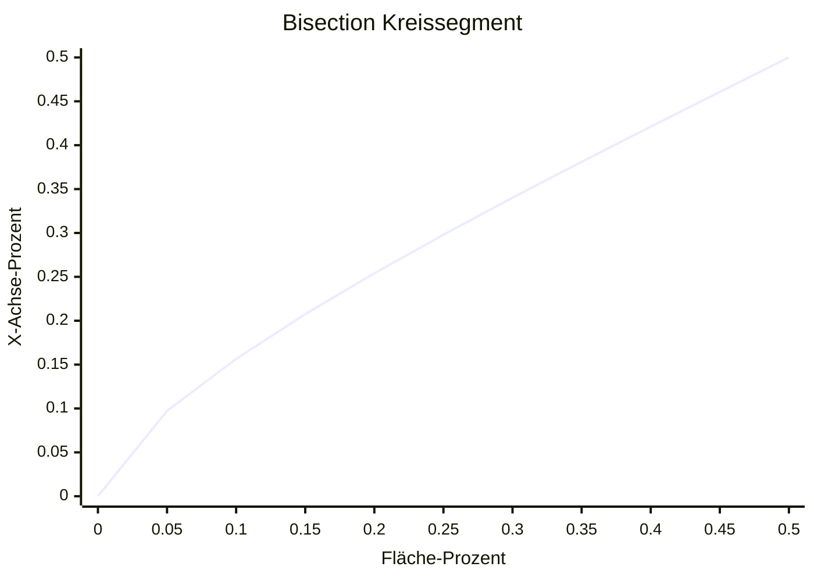
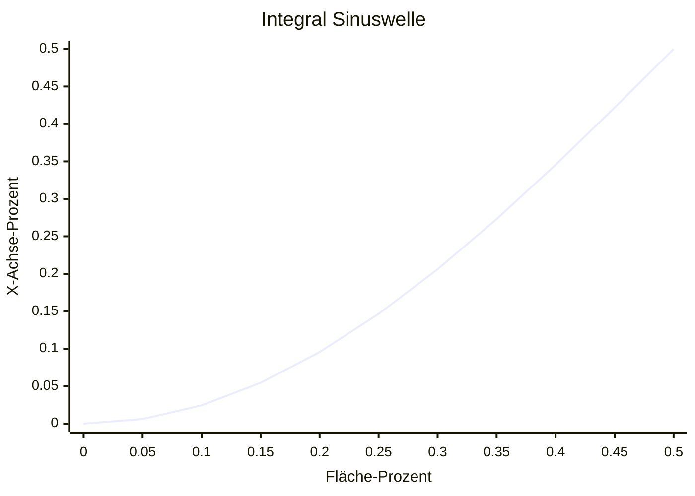

<!-- md custom_banner.md -->

# DIY Heizplatte zum Löten

## Was hat der Leser zu erwarten?

Ich werde sehr auf Details in Programmierung und Elektrotechnik eingehen. Ein gutes Wissen über diese Dinge sollte nicht notwendig sein, ich werde viele Teile erklären, aber ein grobes Verständnis von diesen Dingen hilft. Ich werde durchgehen welche Herausforderungen ich dabei hatte mein erstes komplexes Elektronikprojekt abzuschließen.

## Meine Vergangenheit

Ich habe mich die letzten Jahre nebenher etwas mit Elektronik beschäftigt und ein paar kleinere Projekte gemacht, wie man so anfängt: auf einem Breadboard ein paar Schaltkreise getestet, zuerst mit LEDs, später Transistoren. Ich habe viel über YouTube-Videos und Ausprobieren gelernt. Ich habe dann angefangen [KiCad](https://www.kicad.org/) zu lernen um Schaltkreise und schließlich auch Platinen digital erstellen zu können.

Ich beschäftige mich seit meiner Jugend auch mit 3D Modellierungssoftware, zuerst 3Ds Max, später Blender. Ich programmiere auch seit meiner Jugend, mache das aber mittlerweile auch seit gut 10 Jahren beruflich.

## Warum eine Heizplatte?

Ein anderes Projekt von mir war, eine Erweiterung für FDM 3D-Drucker zu erstellen, womit man 2 Düsen gleichzeitig verwenden kann und die Düsen separat hoch und runter gefahren werden können um nur eine gleichzeitig in Kontakt mit dem zu druckenden Objekt haben. Aktuell verwende ich [Marlin](https://marlinfw.org/), die Hardware in meinem 3D Drucker ist aber so schwach, dass sie gerade so die Firmware ausführen kann, an eine Erweiterung wie sie dafür notwendig wäre, ist nicht zu denken. Ich habe dann online geschaut und bin auf [Klipper](https://www.klipper3d.org/) gestoßen, eine Firmware die den Drucker mit dem RaspberryPi verbindet und den Großteil der Berechnungen auf diesen auslagert. Dadurch braucht man keine so starke Rechenleistung direkt im 3D Drucker. Ich verwende bereits [OctoPi](https://octoprint.org/download/) um meinen Drucker über ein Webinterface und einen zusätzlichen Touchdisplay zu steuern, von daher ein naheliegender Wechsel.

Meine Platine sollte einen [RP2040](https://www.raspberrypi.com/documentation/microcontrollers/rp2040.html)-Prozessor haben, wie er bei RaspberryPi Zero verwendet wird. Das ist ein kleiner, günstiger (~1€) und sehr Leistungsfähiger Prozessor der zur Steuerung der zusätzlichen IOs funktionieren würde, die durch meine Platine zur Verfügung gestellt werden. Klipper erlaubt es auch mehrere Minicomputer mit der Klipper-Firmware miteinander zu verbinden und zusammen arbeiten zu lassen. Meine Platine wäre dann ein zweiter Minicomputer im 3D Drucker.

Ich hatte die Platine über KiCad erstellt und über JLCPCB 5 davon in China produzieren lassen. Bei mir habe ich eine kleine Lötstation mit Lötkolben und Heißluftpistole. Der RP2040 ist ein QFN (Quad Flat No-lead).


  
  


Das heißt es existieren Kontakte nur unter dem Chip, zu dem ist jeder Kontakt nur 0,2mm groß, was es extrem Schwer macht zu löten. Es mag nicht unmöglich sein und manche schaffen das, ich aber nicht, ich habe es versucht... Ich hatte mit der Heißluftpistole den meisten Erfolg, habe dafür den Chip aber recht lange und stark erhitzt, die Beschriftung auf dem Chip war schon verschwunden. Leider hatte der Chip nicht gebootet, ich nehme an er ist dabei kaputt gegangen. Diese Packages sind eigentlich für einen anderen Lötprozess vorgesehen, einen wo man die ganze Platine erhitzt und dadurch das Lötzinn unter dem Chip flüssig wird.

Jemand vernünftiges hätte halt 100€ ausgegeben und sich eine Heizplatte fürs Löten besorgt, dieser jemand bin nicht ich. Ich wollte eine Heizplatte selbst machen und es klang nach einer interessanten Aufgabe, aber natürlich war es viel umständlicher als ich es mir vorgestellt hatte.

## Grobe Übersicht der Schritte

### Verstehen der Anforderung

Ich brauchte eine Heizplatte mit der ich Löten kann. Gefunden habe ich diese [400W Heizplatte](https://www.amazon.de/gp/product/B08XB7MP9L/), die mit Netzspannung läuft, die sollte heiß genug werden zum Löten. Die Platte braucht Netzspannung, das wäre somit mein erstes Projekt wo ich mit Netzspannung arbeiten würde, das hatte ich bisher versucht zu umgehen. Es gibt dabei ein gewisses gesundheitliches Risiko falls ich einen groben Fehler mache.

Ich würde die Heizplatte gerne über einen Mikrocontroller an oder ausschalten können, zur Sicherheit würde ich die Teile des Schaltkreises mit der Netzspannung und die ohne Netzspannung galvanisch trennen, das heißt es gibt keine direkte Stromleitung die die Teile miteinander verbindet, das ist wichtig im Fehlerfall, bei falschem Anschluss oder auch bei Überspannung. Es gibt ein paar Möglichkeiten so etwas zu machen, das klassische für Signale sind Optokoppler. Die kann man sich vorstellen wie eine kleine LED die mit einer Solarzelle verbunden ist, auf der einen Seite scheint die LED und auf der anderen wird durch die Solarzelle ein kleiner Strom erzeugt, den man zum Beispiel als Signal verwenden kann. Für andere Projekte hatte ich bereits PC817 Optokoppler rumliegen, die sind hauptsächlich beliebt weil sie schön günstig sind und für viele Aufgaben ausreichen.

Ich habe auch diverse Transistoren rumliegen, keinen für Netzspannung, aber der BT136 ist dafür geeignet und günstig. Was mir noch fehlte ist ein Optokoppler der mit Netzspannung zurecht kommt. Der PC817 hat einen Transistor der bis zu 35V aushält, Netzspannung beträgt 230V [RMS](https://en.wikipedia.org/wiki/Root_mean_square), das sind maximal ~310V. (Spannungspitze einer RMS-Spannung ist $√2*V$). Das selbe muss der Optokoppler auch in die entgegengesetzte Richtung aushalten, normale Transistoren funktionieren in eine Richtung besser als die andere. Der BT136 ist eine spezielle Art von Transistor die sich Triac nennt, das ist ein speziell konstruierter Transistor der für Wechselspannungen geeignet ist, so etwas brauche ich für einen Optokoppler und das habe ich gefunden im MOC3021M.


  
  
  


### Design

Ich wollte ein Heizelement oben auf einer Box, mit 4 Knöpfen zum Steuern, einem Display und USB-Anschluss zum Auslesen von Daten. Was ich beim Löten des RP2040 gefunden habe ist, dass viele komplexere elektronische Komponenten für eine bestimmte Dauer auf einer bestimmten Temperatur geheizt werden müssen, um sicher zu stellen, dass die Komponente beim Lötvorgang nicht zerstört wird. Diese Heizmodelle wollte ich auf einen USB-Stick packen um leicht neue Modelle verwenden zu können. Zudem musste noch ein Anschluss für die Netzspannung ran. Innerhalb der Box würde ich die Netzspannung dann über ein internes Netzteil auf etwas reduzieren mit dem der RP2040 arbeiten kann.


Ich habe dann damit angefangen die Komponenten die ich bereits hatte in Blender zu übertragen und damit ein 3D Modell zu erstellen. Ich habe auch die Platine in KiCad gemacht und das 3D Modell davon in Blender importiert.


  
  
  



## Probleme auf dem Weg

### Arduino Pro Micro

Ich hatte mich zuerst für den Arduino Pro Micro entschieden, ich hatte zwar Arduinos rumliegen, aber noch nie tatsächlich etwas mit einem Arduino gemacht.


Ich habe mit der Arduino IDE ein kleines Programm geschrieben, dass eine UI auf dem Display anzeigen, die 4 Eingabeknöpfe verarbeiten konnte und über einen Thermistor die Temperatur auslesen konnte.

Thermistoren sind elektrische Widerstände die ein genau definiertes Verhalten bei unterschiedlichen Temperaturen haben, bei höheren Temperaturen steigt der Widerstand in einer Leitung und die sind so produziert, dass die ein sehr genaues Verhalten haben. Die Temperatur misst man dann, indem man die Spannung auf der Leitung misst. Thermistoren werden als Teil eines Spannungsteilers verwendet. Man hat auf der einen Seite zum Beispiel einen 4.7k Ohm Widerstand und auf der anderen Seite den Thermistor und dazwischen liest man die Spannung aus. Vor dem 4.7k Widerstand sind zum Beispiel 5V, hinter dem Thermistor 0V. Wenn der Thermistor 14.1k bei einer Temperatur aufweist, beträgt die Spannung zwischen den Widerständen 3/4 von 5V, also 3.75V $(V*R1/(R1+R2))$.

Leider kann der Arduino Micro Pro nicht als USB-Host fungieren, also keine USB-Sticks auslesen, dafür hätte ich einen anderen Mikrocontroller gebraucht. Daher ich eh mehr mit dem RP2040 arbeiten will habe ich mich für einen Waveshare RP2040-zero entschieden, eine sehr kleine Platine mit einem deutlich Leistungsstärkeren Prozessor und ganzen 200kB RAM anstelle von nur 2kB im Vergleich zu meinem Arduino. Von der Größe her ist der dem Arduino Pro Micro auch ähnlich genug, dass ich dafür die selbe Halterung verwenden kann und kein neues Gehäuse dafür drucken muss.


Die 2kB RAM waren durch das Grafikinterface leider schon recht schnell erschöpft und ich hatte Schwierigkeiten alle Texte und Bilder in den Speicher zu bekommen. Der RP2040 kommt auch mit ganzen 120Mhz und mehreren Kernen her, anstelle von nur 16Mhz und einem Kern, ein willkommenes Upgrade.

### Platform.IO

Platform.IO ist eine Erweiterung für VSCode, die es theoretisch stark vereinfach Code für Mikrocontroller zu programmieren und ich mich als unerfahrener C++-Programmierer nicht noch mit Sachen wie cmake rumschlagen muss. Es gibt einem auch viel mehr Möglichkeiten als die Arduino IDE, wie zum Beispiel Code in Ordnern anordnen zu können und Kontrolle darüber zu haben in welcher Reihenfolge die Dateien inkludiert werden. [stackexchange](https://arduino.stackexchange.com/questions/60656/split-up-arduino-code-into-multiple-files-using-arduino-ide)

Arduinos werden von Platform.IO auch gut unterstützt, leider zählt das nicht für den RP2040 den ich verwenden wollte. Es gibt keinen offiziellen Support dafür, glücklicherweise hat jemand aber einen [Fork](https://github.com/maxgerhardt/platform-raspberrypi) gebaut der das unterstützt, aber aufgrund des Lizenzmodells von Platform.IO, wo die dafür den RP2040 zu unterstützen regelmäßig von Raspberry bezahlt werden wollen, auch wenn Platform.IO selbst nichts an der Anbindung programmiert hat und die bereits fertig zur Verfügung steht, wird das wohl [nie gemerged](https://github.com/platformio/platform-raspberrypi/pull/36#issuecomment-1587171274).

### C++

Das hier ist auch mein erstes richtiges C++ Projekt, ich habe davor ein paar kleine Sachen geschrieben und etwas Code in größeren Code-Basen angepasst, das ist aber das erste eigene Projekt für mich von Anfang an was mehr als nur 1 oder 2 Funktionen ist.

#### #includes und #defines

Folgender [Code](https://github.com/adafruit/Adafruit_TinyUSB_Arduino/blob/e2918652339aa3986f66b32c0a592c1aa72aabc8/src/arduino/msc/Adafruit_USBH_MSC.h): 
```c++
// define SdFat host helper class if SdFat library is available
#if __has_include("SdFat.h")

#include "SdFat.h"

class Adafruit_USBH_MSC_BlockDevice : public FsBlockDeviceInterface {
```

Mit den [Makros](https://learn.microsoft.com/en-us/cpp/preprocessor/macros-c-cpp?view=msvc-170) kann man quasi alles neu definieren und es wird auch gerne verwendet um Abhängigkeiten austauschbar zu machen, in diesem Fall `FsBlockDeviceInterface`, das ist keine Klasse die im Code existiert sondern ein Makro, das als Platzhalter für eine Klasse dient. Der Code soll nur kompiliert werden, wenn es im Code eine Datei namens "SdFat.h" gibt, egal ob im eigenen Code oder in einer verwendeten Bibliothek. Die Bibliothek die eine SdFat.h hat, sollte auch ein `FsBlockDeviceInterface` definieren. Das ist erst einmal ein sehr wackeliges Konstrukt und erfordert entweder eine gute Dokumentation oder, dass sich jemand durch den Code wühlt. Die Dokumentation war natürlich mager. 

Der erste Fehler dazu sah so aus:
```
error: expected class-name before '{' token
   35 | class Adafruit_USBH_MSC_BlockDevice : public FsBlockDeviceInterface {
```
`FsBlockDeviceInterface` wurde während des Kompilierungsprozesses ausgetauscht gegen nichts. Der Compiler hat da nur `class Adafruit_USBH_MSC_BlockDevice : public {` gesehen. Im Framework gab es eine Datei namens SdFat.h, nur war das nicht die, die auch das `FsBlockDeviceInterface` definiert.

Die Lösung für dieses erste Problem war es, eine Bibliothek rauszusuchen, die eine SdFat.h besitzt und hoffen, dass das die ist, die hier gewollt ist und in einer kompatiblen Version. Glücklicherweise hatte das geklappt.

Dann kamen noch Fehler, dass eine SPI.h-Datei fehlt. SPI ist ein anderes Hardware-Protokoll ähnlich zu I²C, dass ich aber gar nicht brauche, irgendeine Datei scheint es trotzdem zu inkludieren. Die Datei die das braucht, macht das mit `#include "SPI.h"`. Im Framework gab es aber bereits eine SPI.h-Datei, die er aber nicht gefunden hat.

Es gibt 2 unterschiedliche Varianten diesen include zumachen, entweder `#include "SPI.h"` oder `#include <SPI.h>`. Im Code wurde mal die eine, mal die andere Variante verwendet. Der [Unterschied](https://stackoverflow.com/questions/3162030/difference-between-angle-bracket-and-double-quotes-while-including-heade) ist in etwa, "" sucht vom aktuellen Verzeichnis aus, für <> muss die Datei in einer include-Liste stehen, in der die Datei anscheinend fehlte. Ein vorläufiger fix war es im Quellcode-Verzeichnis meines Projektes eine SPI.h anzulegen, die per absoluten Pfad die SPI.h aus dem Framework-Verzeichnis inkludiert, das leider per absoluten Pfad.

In C++ inkludiert man Dateien in der Regel nur per Dateinamen und wenn man im eigenen Quellcode-Verzeichnis eine Datei mit dem selben Namen anlegt wie der einer Datei von einer Bibliothek die man verwendet, kann man sie überschreiben. Das war mir auch aus versehen passiert. Dann bekommt man plötzlich Fehler im Code einer Abhängigkeit, dass irgendein Feld oder eine Klasse nicht existiert, die aus der Bibliothek kommt, besser ist die Fehlermeldung nicht.

Später konnte ich die SPI.h rausschmeißen, warum es dann plötzlich funktionierte weiß ich nicht. Ich hatte meine verwendeten Bibliotheken aktualisiert, vielleicht dadurch.

#### underflows

Ein anderes Problem, dass auch in anderen Sprachen existiert, ich aber erst mit C++ drauf gestoßen bin, waren underflows. Wenn man eine Zahl erhöht, kann sie über die Größe des Datenfeldes, wie zum Beispiel 32-bit, hinausgehen und anstelle einer großen Zahl, hat man dann plötzlich eine kleine Zahl. Das selbe geht auch in die andere Richtung, wenn man Zahlen voneinander subtrahiert und das Datenfeld `unsigned` ist, also keine negativen Zahlen erlaubt, bekommt man plötzlich eine sehr große Zahl.

In Sprachen wie C#, wird häufig `int` oder `float` verwendet. Das sind 32-bit Zahlentypen die negative Zahlen zulassen. Bei der Programmierung von Firmware, hat man aber nicht selten mit Zahlen zu tun wo deutlich mehr auf effiziente Speichernutzung geachtet wird. Anstelle von `int`, wird da `unsigned long` oder `size_t` verwendet. `unsigned long` ist eine 32-bit Zahl ohne Vorzeichen, also ohne negative Zahlen. `size_t` ist in diesem Fall 8-bit, ohne Vorzeichen.

Typischerweise fängt man bei Zahlen nicht mit dem höchsten möglichen Wert an, sondern bei 0, wenn man sonst addiert hätte man sofort einen overflow. Mit 0 hat man einen schönen Mittelwert und Raum nach oben und unten. Bei einer `unsigned` Zahl, fängt man mit 0 bereits beim Minimum an und sobald man etwas subtrahiert, bekommt man einen underflow. Dabei ist es egal ob das Ergebnis einer Berechnung positiv wäre, solange auch nur irgendein Zwischenergebnis der Berechnung negativ werden würde, bekommt man einen underflow.

`unsigned long` ist hier ein typischer Zahlentyp um die aktuelle Zeit zu bekommen. Einige Fehler waren beim Verrechnen von Zeitstempeln entstanden.

## Wo habe ich mich verlaufen?

### PID-Tuning

#### Was ist PID?

Ich möchte für meine Heizplatte einen PID-Controller mit einprogrammieren. PID steht dabei für Proportional, Integral, Derivative. Damit steuert man die Leistung des Heizelements um möglichst akkurat und schnell die Zieltemperatur zu erreichen. Wenn man einfach nur anschaltet wenn die aktuelle Temperatur niedriger als die Zieltemperatur und ansonsten ausschaltet ist das für gewöhnlich recht ungenau. Die Temperatur oszilliert um die Zieltemperatur herum.

Bild (Oszillierende Temperatur)

Der PID-Controller passt die Leistung so an, dass er nahe der Zieltemperatur der Stärke reduziert (Proportional). Das führt aber häufig dazu, dass er kurz vor der Zieltemperatur stehen bleibt, um das zu verhindern akkumuliert er über Zeit den Temperaturunterschied und erhöht die Leistung, wenn für längere Zeit ein Temperaturunterschied bestehen bleibt (Integral). Häufig reichen diese beiden Systeme bereits aus, wenn man die Leistung aber noch optimieren will, sorgt man dafür, dass wenn die Temperaturkurve zu früh abflacht oder man vielleicht auch über das Ziel hinausschießen würde, man die Leistung hoch bzw. runterjustiert um schneller die Zieltemperatur zu erlangen (Derivative). Eine Seite die mir sehr beim Verstehen von PID geholfen hat ist [crystalinstruments](https://www.crystalinstruments.com/blog/2020/8/23/pid-control-theory).

Eine übliche Methode die 3 verschiedenen Faktoren für PID zu finden, ist es händisch durch zu probieren, was einem gute Ergebnisse liefert. Kann einige Versuche dauern, man nährt sich da iterativ. Gerade für Situationen wo man vielleicht nur ein paar Geräte hat, ist das absolut sinnvoll. Ich habe nur 1 Gerät, war aber fasziniert davon wie Algorithmen diese Faktoren automatisch finden können.

#### Mein Algorithmus

Ich habe damit angefangen in C# eine Art Simulator zu schreiben. Ein Heizelement, dass sich erhitzt und die Temperatur in einer bestimmten Rate an die Umgebung abgibt und auch an den Sensor übertragt. Die Rate ist dabei abhängig vom Temperaturunterschied zwischen den beteiligten Objekten. Das war glücklicherweise recht schnell geschrieben und ich hatte eine Simulation die mir Graphen ausspuckt, die ähnlich aussehen wie die Kurven vom 3D-Drucker. Bei der Software war der komplizierteste Teil eine Bibliothek zu finden, die mir einen Graphen zeichnet, über die Kommandozeile, auf Linux, in C#.

Ich habe zwei verschiedene Algorithmen ausprobiert, [Ziegler-Nichols](https://de.wikipedia.org/wiki/Faustformelverfahren_%28Automatisierungstechnik%29) und den von [Marlin](https://github.com/MarlinFirmware/Marlin/blob/9e879a5b1f801e7572e7948be38a6dad16ad35d8/Marlin/src/module/temperature.cpp#L673). Beide haben in meinem Simulator aber keine guten Ergebnisse geliefert, es kann gut sein, dass ich bei der Implementierung Fehler gemacht habe, mir hat an den Methoden aber auch nicht gefallen, dass da magische Zahlen ohne Erklärung drin vorkommen. Das war für mich nicht nachvollziehbar.

Also habe ich mit etwas rumprobieren, versucht meinen eigenen Algorithmus zu erstellen. Mein Simulator hat eine Testsuite bekommen, Szenarien mit verschiedenen Simulationsparametern, die dann automatisch validiert wurden, wenn ich etwas am Algorithmus angepasst habe.

Beim PID-Tuning wird das Heizelement erst einmal in einem [Bang-Bang-Modus](https://control.com/textbook/closed-loop-control/onoff-control/) betrieben, währenddessen werden einige Daten gesammelt und aus diesen Daten berechnet ein Algorithmus die PID-Faktoren.


  
  


Angefangen habe ich damit, den Algorithmus so zu entwerfen wie ich PID und Heizkurven verstehe. Logisch heranzugehen was nach meinem Verständnis dazu beitragen würde eine gute saubere Kurve zu erzeugen, natürlich hat mich das nicht sehr weit gebracht. So bin ich dann dazu übergegangen Zahlen miteinander zu kombinieren die mich nahe an die Werte heranbringen die ich erwarte. Ich hatte mehrere Szenarien die auf bestimmte Art nicht funktionierten und mit den Graphen von crystalinstruments konnte ich abschätzen welcher Faktor in etwa in welche Richtung angepasst werden müsste um das zu lösen. Dann habe ich geschaut welche Werte spezifisch zu den Szenarien sind die nicht funktionieren und die dann versucht mit zu verrechnen bis ich ein gutes Ergebnis bekam. Am Ende habe ich eigentlich nicht mehr verstanden was ich tue, aber das Ergebnis war gut. Es hat alle meine Testszenarien erfüllt, bei ein paar Szenarien hätten die Werte etwas optimaler sein können, aber mit dieser Methode löse ich das auch nur annäherungsweise, es ist keine ganz korrekte Methode und das letzte bisschen rauszuholen ist recht aufwendig. So die klassische 80/20-Regel, mit 20% des Aufwandes komme ich so etwa 80% zur Lösung, die restlichen 20% würden aber 80% der Zeit dauern und es ist aktuell gut genug.


  
  
  
  
  


### Sinuswelle zu Leistung

Ein eigentlich unnötiger Punkt mit dem ich auch einiges an Zeit verbraucht habe war einen möglichst genauen Weg zu finden mein Heizelement, dass sich nur an oder ausschalten lässt, zu etwas zu verwandeln, dass ich teilweise anschalten kann. Anstatt nur 0% oder 100%, auch 10%, 30%, 50% oder was auch immer ich will. Das ist genau genommen auch notwendig damit PID funktioniert, aber der grad an Genauigkeit mit dem ich es versucht habe, war unnötig.

Um das Heizelement prozentual anzusteuern, war der erste Teil es per [PWM](https://www.elektronik-kompendium.de/sites/kom/0401111.htm) zu schalten. Das Heizelement läuft mit Wechselstrom, das läuft hier mit etwa 50 Hertz. Die PWM-Frequenz wurde dann auf die 50 Hertz festgelegt, dazu habe ich auf meiner Platine einen [Zero-Crossing](https://en.wikipedia.org/wiki/Zero-crossing_control)-Schaltkreis mit dem PC817, ein paar Widerständen und Dioden eingebaut. Dadurch bekommt der Mikrocontroller ein Signal wenn die Netzspannung gegen 0 fällt und der Mikrocontroller passt entsprechend das Timing und die Frequenz des PWM-Signals an.

Eine höhere Frequenz für das PWM anzusetzen wäre auch nicht möglich gewesen aufgrund der verwendeten Komponenten. Ein Triac leitet Strom wenn am Gate Spannung anliegt, der bleibt dann an bis zum nächsten Nullpunkt, egal ob am Gate noch Spannung anliegt oder nicht.

Mit dem RP2040 bestimmte ich dann die Wartezeit um den Triac bei zum Beispiel 50% der Sinuswelle der Netzspannung anzuschalten für meine 50% Leistung. Die Leistung die das Heizelement bekommt, hängt aber genau genommen von der Fläche unterhalb der Sinuswelle bis zum Nullpunkt ab (bzw. oberhalb falls wir in der anderen Hälfte der Sinuswelle sind).

Bei 0%, 50% und 100% ist der Zeitpunkt an dem der Triac an geschalten werden muss gleich der Fläche, in allen anderen Fällen gibt es aber eine gewisse Abweichung. 


[Interaktiver Link](https://www.desmos.com/calculator/t0subox9jh)

Nach etwas Recherche habe ich Formeln gefunden wo man die Fläche eines Segmentes eines Kreises berechnen kann, der an einem bestimmten Punkt abgeschnitten wurde. Das Problem war, ich suche das Gegenteil, eine Formel um anhand der Fläche den Punkt zu finden wo die Sinuskurve abgeschnitten werden kann. Ich hatte Formeln umstellen in der Schule, ich habe aber nie eine so komplizierte Formel umgestellt und anstatt es erst einmal selbst zu probieren, habe ich mich an ChatGPT gewannt.

$Asegment = r² × arccos((r-h)/r) - (r-h) × √(2 × r × h - h²)$

Was eine gute Idee war, denn die Antwort die es mir gab war, dass es keine geschlossene Lösung für die umgestellte Formel gibt, also keine Formel die direkt eine Lösung bringt, so wie die Ausgangsformel, stattdessen muss man da mit einer numerischen Lösung herangehen. Das heißt, näherungsweise sich an den richtigen Wert heranrechnen, es gibt keine bekannte Formel die das direkt kann (laut ChatGPT, ich habe aber auch nichts gefunden).

Nach etwas nachfragen bei ChatGPT, habe ich über die [Bisection](https://en.wikipedia.org/wiki/Bisection_method)-Methode gelernt, mit etwas Starthilfe von ChatGPT und Stackoverflow habe ich dann in C# eine Bisection-Methode für die Formel geschrieben, die mir dann in 5% Schritten die Werte ausgibt die ich brauche. In der Firmware für die Heizplatte würde ich dann diese Tabelle nehmen und die restlichen Zwischenschritte einfach interpolieren. Ich hatte auch nach einer Bibliothek geschaut die Bisection schon kann, aber mit ChatGPT ging das eigentlich so schnell, dass es wahrscheinlich länger gedauert hätte eine funktionierende Bibliothek zu finden und anzubinden.

Der Unterschied zwischen dem Prozent der Fläche der Sinuskurve und den Prozent entlang der X-Achse der Periode einer Sinuskurve, war mit der Methode sehr gering. Häufig nur 5% bis es dann zur Mitte hin konvergiert.
Den Unterschied der Prozentzahlen zwischen Fläche und X-Punkt hatte ich mir deutlich größer vorgestellt und es schien vollkommen unnötig, dass ich mir die Mühe gemacht hatte.



Die Formeln und die Empfehlung von ChatGPT klang für mich auch recht sinnvoll. Die Fläche eines Einheitskreise sollte gleich der Fläche unter einer Periode der Sinuskurve sein, wenn man zum Beispiel bei einem Integral die Fläche absolut nimmt, und nicht die negative Seite der Sinuskurve wieder abzieht. Irgendwo hatte sich da aber ein Fehler eingeschlichen, der mir damals nicht aufgefallen war.



Diese Visualisierung hatte ich damals nicht gemacht, erst für diesen Blog. Hätte ich das gemacht, hätte ich gesehen, dass ich die Formel nur ein bisschen hätte anpassen müssen, weil meine Werte entlang der Diagonalen gespiegelt waren.
Ich habe das alles am Ende aber gar nicht gebraucht, weil ich wie weiter unten beschrieben, dann ein ganz anderes System gewählt habe.

## Die Teile zusammenfügen

### Pull-Downs

Die Heizplatte sollte 4 Knöpfe zur Bedienung haben: Back, Enter, Up, Down. Jeder der Knöpfe ist an einen Pin des Mikrocontrollers angeschlossen und wenn die Spannung hoch ist, wird die Taste als gedrückt erkannt. Wenn an einer Leitung kein Strom fließt, ist die Spannung aber nicht 0. Wenn man die Spannung ausliest, können da trotzdem Volt drauf liegen die irgendwo zwischen 0V und der Spannung liegen die da mal drauf war. Das nennt man dann "floating". Das kann man dann mit Pull-Down-Widerständen lösen, die ziehen eine kleine Menge Strom gegen 0V und reduzieren dann das restliche elektrische Potential, dass noch in der Leitung gespeichert ist auf diesen Wert.

Ein Problem, dass ich mit dem Arduino hatte, war dass der keine Pull-Down-Widerstände kann. Das war relevant für die Knöpfe die für die Heizplatte vorgesehen waren, die Platine hatte ich entworfen unter der Annahme, dass der Arduino, wie der Raspberry Pull-Downs kann. Um das Problem in der Version für den Arduino zu beheben, hatte ich nachträglich Widerstände auf meine Platine gelötet. Die waren mit dem Wechsel zum RP2040 nicht mehr notwendig.

### Der Display

Ich hatte eine Arduino mittlerweile gegen einen RP2040 ausgetauscht, mit dem Arduino funktionierte der [Display](https://www.az-delivery.de/products/1-3zoll-i2c-oled-display?variant=6571890704411) sauber, mit dem RP2040 hat er stark geflackert.

Wieso? Das fragte ich mich die nächsten Wochen häufiger.

Ich habe den Mikrocontroller ausgetauscht, bin von Arduino IDE nach Platform.IO gewechselt und benutze ein anderes Framework um den RP2040 zu steuern. Irgendwo dort sollte der Fehler sein, ich habe mir etwas den Quellcode des neuen Frameworks angeschaut, bin daraus aber nicht schlau geworden und habe mich entschieden zu versuchen einen debugger einzurichten. Eine Methode, dass mit einem RP2040 zu machen ist es ein Debug-Probe zu verwenden.


Nachdem ich die Firmware dafür kompiliert und übertragen hatte, musste ich den Debug-Probe noch anschließen, an SWDIO und SWDCLK Pins anschließen. Leider sind diese Pins auf dem Waveshare RP2040-zero winzig, etwa 1mm x 1mm. Da Kabel anzulöten hat sich für mich als zu schwierig erwiesen, weil ich dabei ein Pad abgerissen habe.


Das nächste war einen neuen Mikrokontroller zu kaufen. Die RaspberryPi Zero sind günstiger als die Waveshare-Variante, dafür aber deutlich größer als der Waveshare oder der Arduino Pro Micro. Der neuen Chip würde nicht sauber in das Gehäuse passen, das war jetzt aber egal, ich wollte vorwärts kommen.

Der Display wird mit dem Hardwareprotokoll [I²C](https://www.mikrocontroller.net/articles/I%C2%B2C) gesteuert. Über die Software kann ich die Übertragungsgeschwindigkeit reduzieren, dann sieht man wie sich das Bild langsam aufbaut, dann sehr schnell flackert und dann weiter geht. Mein Vermutung war, dass irgendwelche Befehle an den Display übertragen werden mit denen der nicht klar kommt und dadurch während des Bildaufbaus flackert. Mit dem Debugger wollte ich schauen welche Code da gerade ausgeführt wird, der Probleme verursachen könnte, bis dahin hatte ich nichts im Code gefunden, dass nach falschen Befehlen aussieht. Sobald der Debugger jedoch angeschlossen war, hat sich der Display abgeschaltet. Das hatte ich mir anders vorgestellt. Bei dem Display soll man sogar einmal ein Bild übertragen können und es bleibt bestehen bis man neue Daten sendet. Umso merkwürdiger, dass der Display plötzlich ausging wenn der Debugger den Code des Mikrocontrollers angehalten hat.

Es waren dann ein paar Tage mit debuggen vergangen, bis ich im Framework in einer Klasse die sich um die I²C-Kommunikation gekümmert hat etwas gefunden habe, womit man einen Timeout bei der Kommunikation einstellen kann. Ich habe die Timeout-Logik deaktiviert und plötzlich hat sich mein Display nicht mehr abgeschaltet wenn der Debugger angesprungen ist. Das Flackern war auch plötzlich weg. Es stellt sich heraus, dass der Timeout selbst ausgeführt wurde wenn der Debugger die Kontrolle übernimmt und der Timeout hat dazu geführt, dass die I²C-Verbindung von der Klasse geschlossen wird und der Display sich daraufhin ausschaltet.

Sehr ärgerlich, ein timeout, den ich nicht festgelegt habe und für mich kontraproduktiv ist, war standardmäßig aktiv. Wieso das ein opt-out und kein opt-in ist, gerade für Hardware-nahe Programmierung, erschließt sich mir nicht. Die I²C-Klasse kann ja nicht wissen was am anderen Ende angeschlossen ist und ob ein Deaktivieren des Gerätes am anderen Ende besser ist als es zumindest mit einem Teil der übertragenen Daten weiterlaufen zu lassen.

Es gibt jetzt noch das Problem, warum kam es zu einem timeout beim Übertragen der Daten? Das Flackern war jetzt weg und ich konnte mit dem debugger den Bildaufbau unterbrechen, leider hat sich dann gezeigt, das nicht alle Bilddaten sauber übertragen wurden. Die Bibliothek die ich zum Zeichnen des Interfaces verwende und die bestimmte welche Befehle über I²C übertragen werden ist [u8g2](https://github.com/olikraus/u8g2). Diese übertragt das Bild nicht in einem einzelnen I²C-Packet, sondern teilt es in kleiner Blöcke auf um nicht so viel Arbeitsspeicher zu verbrauchen. Wenn es einen I²C-Fehler gab, wurde der Block nicht angezeigt und das Bild hat sich dann verschoben. Beim Flackern gab es das Problem nicht, denn wie sich später herausgestellt hat, läuft die Übertragung beim Aufbau des ersten Bildes sauber ab, sie bricht nur kurz darauf zusammen. Beim Flackern konnte er also noch das erste Bild aufbauen, hat dann einen Fehler gehabt, den Display neu gestartet und konnte daraufhin häufig wieder, wenn auch nicht immer, sauber ein Bild übertragen. Wenn der Display aber länger an war, gab es nur noch Fehler. Das ständige An- und Ausschalten des Displays war das Flackern.

Software-seitig hat also alles funktioniert, aus irgendeinem Grund kamen die Pakete nicht an, um das herauszufinden, versuchte ich als nächstes die Hardware zu debuggen. Mein größter Freund dabei war, ein [Oszilloskop](https://de.wikipedia.org/wiki/Oszilloskop) an die Datenleitung anzuschließen und zu schauen was da abgeht.


Glücklicherweise kann mein Oszilloskop ein paar verschiedene Hardware-Protokolle verstehen, darunter auch I²C. Damit hatte sich gezeigt, dass die meisten Pakete vollständig sind, tatsächlich werden alle Pakete korrekt gesendet, ein Detail des I²C Protokolls ist aber, dass jedes Paket vom Empfänger bestätigt werden muss durch runterziehen der Datenleitung auf 0 Volt. Der Display versucht das, schafft nach einigen Paketen aber nur noch so 1-2 Volt, welche vom Mikrokontroller dann als nicht empfangen interpretiert werden, was dann den Sendungsvorgang durcheinander bringt.

Nacht etwas herumexperimentieren hat sich herausgestellt, dass der Fehler auf 2 Problemen basiert, die gemeinsam gelöst werden mussten. Das erste Problem war, ich habe den Mikrokontroller und Display über die 5V vom USB-Anschluss betrieben. Der RP2040 hat aber eine eigene 3.3V Stromversorgung an Bord und sämtliche IO-Kommunikation läuft über 3.3V. Daher der Display aber mit 5V betrieben wurde, hat er angenommen, dass die Kommunikation auch mit 5V läuft und hatte Probleme gute Signale mit einer 3.3V Leitung zu senden.
Der Arduino Pro Micro ist ein 5V System, wodurch es dort wohl nicht zu Problemen kam, weil die Spannung der Stromversorgung gleich der Spannung der Kommunikation war.
Der RaspberryPi Zero bietet einen Pin an um sich an die 3.3V des RP2040 anzuschließen, als ich den Display darüber anschloss wurde die Signalrate auf dem Oszilloskop besser, aber leider noch zu Fehlerbehaftet.

Etwas Googeln hat dann ergeben, dass für I²C-Kommunikation Pull-Up-Widerstände empfohlen werden. Die waren auf den Beispiel-Schaltkreisen die ich mir anfangs angeschaut hatte nicht drauf und auch beim Arduino nicht notwendig. Ich habe dann mit etwas Mühe, das Datenkabel so abgeändert, dass da Pull-Up-Widerstände von den Datenleitungen zur Stromversorgung gehen. War eine Frickelei, hatte dort eine Weile einen Wackelkontakt, den ich mit einer Zange und einem Lötkolben aber noch behoben bekommen habe. Damit war dann endlich die Kommunikation sauber und der Display hat funktioniert.

### 3.3V ADC

Als es mit der Integration weiterging, habe ich Strom an den Hauptschalter angeschlossen, der dann über ein internes Netzteil auf 5V für den Mikrokontroller reduziert wird, anstatt alles über den USB-Anschluss zu versorgen.

Teil des Systems ist es die Temperatur auszulesen wofür der **A**nalog-to-**D**igital-**C**onverter die Spannung auf dem Thermistor misst. Dafür müssen vor dem Spannungsteiler 3.3V liegen, weil der ADC nur bis 3.3V messen kann, nicht die ursprüngliche geplanten 5V. Sobald ich die Stromversorgung über das interne Netzteil machte konnte aber nicht mehr die Temperatur ausgelesen werden bzw. waren die ausgelesen Werte total falsch.

Ich habe die Stromversorgung meiner Platine, auf der der Spannungsteiler für den Thermistor ist, an das Oszilloskop angeschlossen und habe nur 1V auf der Leitung gesehen. Bei den ganzen Tests davor hat es aber geklappt und als ich die Stromversorgung des Displays von 5V auf 3.3V reduziert hatte, hatte ich auch die Stromversorgung meiner Platine auf 3.3V reduziert, weil der ADC auch nur bis zu 3.3V verträgt und messen kann. Während der Tests mit USB waren da auch immer 3.3V drauf. Wie sich herausstellt hält der RP2040 nur die 3.3V wenn eine Stromversorgung über USB angeschlossen ist, wenn das nicht der Fall ist taktet er seine interne Stromversorgung auf 1V runter. Die Stromversorgung ist nach dem Hochfahren des Systems auch für grob 1 Sekunde 3.3V, fällt dann aber auf 1V. Ich habe nicht rausgefunden ob es eine Möglichkeit gibt, das zu verhindern. Stattdessen habe ich in das Gehäuse noch ein kleines Netzteil gepackt, das die 5V auf 3.3V runter taktet und das für die Platine und den Display genutzt. Im Gehäuse war so etwas nicht vorgesehen, aber das ist ein Problem, dass ich für eine Version 2 löse, jetzt muss der Prototyp fertig werden.

### PWM

Wie weiter oben geschrieben, bleibt ein Triac aktiv, sobald Spannung am Gate anliegt, bis die Spannung auf den Terminals gegen 0 fällt. Das hatte ich zuerst nicht bedacht und das PWM so geschrieben, dass die Kurve am Anfang mit an geht und an einem bestimmten Punkt, entsprechend der gewünschten Leistung abschaltet. Das hat natürlich nicht funktioniert und so schrieb ich es um, um umgekehrt zu funktionieren, es ist zuerst aus und schaltet sich dann an. Leider führte das zu hörbaren Schaltgeräuschen. Es ist kein Relay verbaut, nur ein Transistor, ich bin nicht ganz sicher wie das Geräusch dabei entsteht. Vielleicht entsteht durch das Anschalten auf eine plötzlich hohe Spannung eine deutliche höhere Spannungsspitze als nur die 310V und der Strom springt zwischen den Kontakten meiner Platine? Etwas das man vielleicht mit einem besseren Design unterbinden könnte, wo zwischen den Teilen mehr Abstand ist.

Genauer habe ich mich damit aber nicht beschäftigt, sondern die PWM-Steuerung so abgeändert, dass die Frequenz nicht die 50Hz der Netzleitung sind sondern 1Hz. Für ein Heizelement muss die Frequenz nicht hoch sein. Das heißt aber, dass alles was mit der Leistung der Sinuswelle zu tun hat umsonst war. Ich verwende noch das Zero-Crossing um zwischen An und Aus nur an einem Nullpunkt zu schalten und so Geräusche zu unterbinden.

## Version 2

In KiCad und Blender habe ich bereits eine V2 vorbereitet. Dort werde ich die Menge an Kabeln stark reduzieren in vieles besser in meine Platine integrieren. Der Mikrokontroller, das Netzteil und das 5V-zu-3.3V Model kommen alle direkt auf meine eigene Platine. Zu viele Kabel ist ein Problem, dass ich auch schon bei anderen Projekten früher hatte. Es ist ein Chaos das zu schnell außer Kontrolle gerät, hat aber den Vorteil, nachträglich noch einiges Anpassen zu können ohne direkt eine neue Platine zu brauchen. Es ist in gewisser weise nützlich für Prototypen, aber etwas das in einer finalen Version nichts zu suchen hat.

Etwas das ich für zukünftige Projekte auch anpassen werde ist es deutlich großzügiger mit Test-Pads zu sein. Das sind Kontakte auf der Platine, die zum debuggen gut sind, damit kann ich einfacher untersuchen was auf der Platine los ist. Ich kann mein Multimeter oder Oszilloskop zwar auch an die Lötpunkte von Widerständen oder Chips legen, ist aber eine Frickelei. Ich werde auch Test-Pads für Leitungen mit höherer Spannung mit einem Through-Hole machen. Normale Pads sind einfach nur eine leitende Fläche auf der Oberfläche der Platine, bei einem Through-Hole geht ein Loch durch die Platine, was es einfacher macht Probes bzw. Sonden dort festzustecken. Wenn auf der Leitung Netzspannung liegt, will ich meine Hände weit entfernt davon haben, das soll alles von selbst gehalten werden. Wenn man 5V abbekommt, spürt man das gar nicht, bei 220V AC sieht das wahrscheinlich anders aus. Die Erfahrung habe ich noch nicht gemacht.

Etwas, das ich Zukunft lernen muss, ist es nicht am Anfang schon zu tief zu gehen, um zu verhindern, dass ich an Teilen arbeite die sich dann als unnötig herausstellen, wie die Leistung der Sinuswelle.


  
  
  
